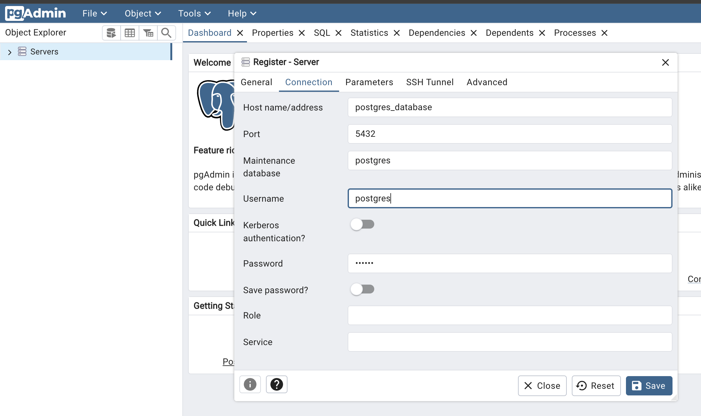

# Nest PDF Reports

## Starting

1. Create the .env file based on the .env.template
2. Install the dependencies: `pnpm install`
3. Start the PostgresDB and pgAdmin containers: `docker-compose up -d`
4. Config the PostgresDB Server
   
5. Generate the Prisma client: `npx prisma generate`
6. Start the server: `pnpm run start:dev`
